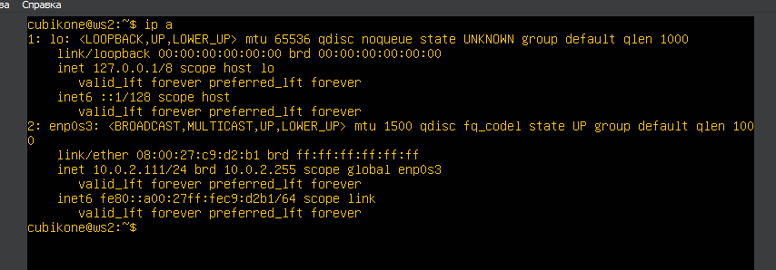
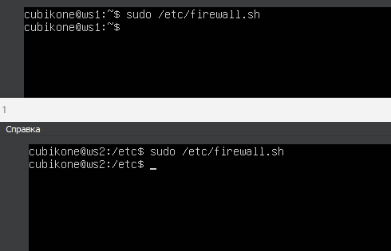
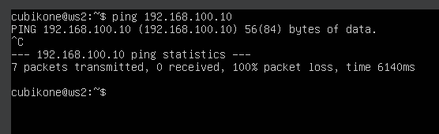
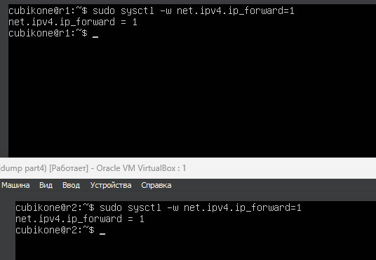
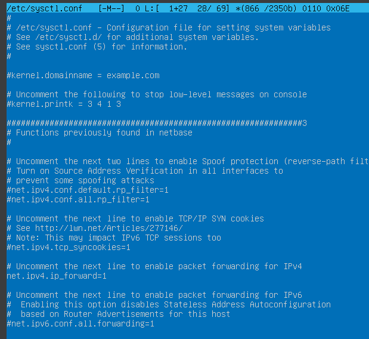
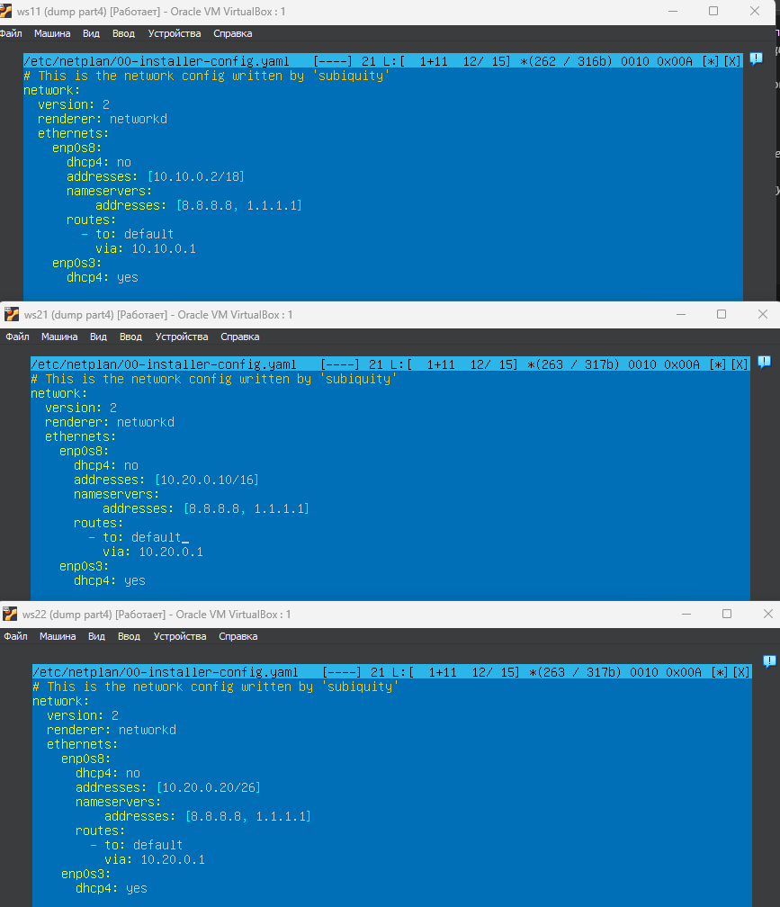
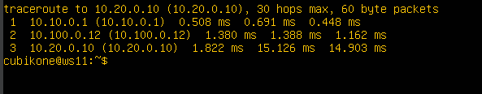

## Part 1. Инструмент **ipcalc**

1.   
Устанавливаем инструмент ipcalc(sudo apt install ipcalc) 
 
 
 

2.   
- ввел команду ipcalc 192.167.38.54/13  
- адрес сети - 192.160.0.0/13 
 
 
 

3.   
    - ввел команду ipcalc 192.167.38.54/13  
    - 255.255.255.0 = префиксная 24  +
    - 255.255.255.0 = в двоичной 11111111.11111110.00000000.00000000  
 
 
 

4.   
    - ввел команду ipcalc /15  
    - /15 = обычная 255.254.0.0
    - /15 = двоичная 11111111.11111110.00000000.00000000 
 
 
   
  
5. 
    - 11111111.11111111.11111111.11110000 в десятичную систему это будет 255.255.255.240
    - 11111111.11111111.11111111.11110000 =  первые 28 бит отведены для сети, а оставшиеся 4 бита отведены для хостов, префикс /28 
 
 
 

6.   
    - ввел команду ipcalc  12.167.38.4/8 
    - Минимальный хост: 12.167.0.1
    - Максимальный хост: 12.167.255.254
 
 
 

7.   
    - Маска 11111111.11111111.00000000.00000000 это та же самая маска /16  
    - ввел команду ipcalc  12.167.38.4/16
    - Минимальный хост: 12.167.0.1
    - Максимальный хост: 12.167.255.254 
 
 
 

8. 
    - ввел команду ipcalc  12.167.38.4/255.255.254.0
    - Минимальный хост: 12.167.38.1
    - Максимальный хост: 12.167.39.254 
 
 
 

9. 
    - ввел команду ipcalc 12.167.38.4/4
    - Минимальный хост: 0.0.0.1
    - Максимальный хост: 15.255.255.254 
 
 
 

10. 
    - 194.34.23.100 - этот ip не является частью диапозона, подключитсья невозможно
    - 127.0.0.2 - этот ip принадлжеит диапозону, подключение возможно
    - 127.1.0.1 - этот ip принадлжеит диапозону, подключение возможно
    - 128.0.0.1 - этот ip не является частью диапозона, подключитсья невозможно 
 
 
 

11.  
    - частные ip адреса
 
 
 

12. 
    - ipcalc 3 ip адресов выше
    - 10.0.0.45 - частный
    - 134.43.0.2 - публичный
    - 192.168.4.2 - частный
    - 172.20.250.4 - частный
    - 172.0.2.1 - публичный
    - 192.172.0.1 - публичный
    - 172.68.0.2 - частный
    - 172.16.255.255 - частный
    - 10.10.10.10 - частный
    - 192.169.168.1 - публичный 
 
 
 

13. 
- диапозон от 10.10.0.1 до  10.10.63.254
    - 10.0.0.1 - не входит в диапозон 
    - 10.10.0.2 - входит в диапозон
    - 10.10.10.10 - входит в диапозон
    - 10.10.100.1 - входит в диапозон
    - 10.10.1.255 - не входит в диапозон 
 
 
 

## Part 2. Статическая маршрутизация между двумя машинами

1.  
2.  
    - ip a для ws1 и ws2
 
 
 

3.  
    - Измененный конфиг для ws1 
 
 
 

4.  
    - Измененный конфиг для ws2 
 
 
 

5.  
    - sudo netplan apply для ws1 и ws2 
 
 
 

6.  
    - ввёл команду sudo ip r add 172.24.116.8 dev enp0s3, после чего успешно пропинговал ws2 
 
 
 

7.  
    - ввёл команду sudo ip r add 192.168.100.10 dev enp0s3, после чего успешно пропинговал ws1 
 
 
 

8.  
    - изменил конфигурационный файл для ws1 и ws2, добавив статическую маршрутизацию с помощью routes 
 
 
 

9.  
    - пинг от ws1 -> ws2 и пинг от ws2 -> ws1 
 
 
 

## Part 3. Утилита **iperf3**

1. Перевод:
    - 8 Mbps = 1 MB/s
    - 100 MB/s = 800 Kbsp
    - 1 Gbps = 1000 Mbps 
 
 
 

2. 
    - sudo apt install iperf3 
 
 
 

3. 
    - на ws2 iperf3 -s -f M(для отображения в МегаБайтах)
    - на ws1 iperf3 -c 172.24.116.8(для подключения) 
 
 
 

4. 
    - на ws1 iperf3 -s -f M(для отображения в МегаБайтах)
    - на ws2 iperf3 -c 192.168.100.10(для подключения) 
 
 
 

## Part 4. Сетевой экран

1. 
2. 
    - F - очищает все правила и цепочки 
    - X - удаляет пользовательские цепочки
    - A - добовляет правило в конец указанной цепочки
    - p - указывает протокол для правила
    - dport - указывает порт для трафика
    - j - цель для правила 
    - icmp-type - для указания типо ICMP-сообщения 
 
 
 

3. 
    - вызов команды firewall.sh
 
 
 

4. 
    - вызов команды iptables -L для проверки. 
 
 
 

5. На ws1 в начале применяется запрещающее правило (DROP), а затем разрешающее правило (ACCEPT), сначала блокируется весь трафик, а затем разрешается только определенный, весь трафик будет отвергнут, если не соответствует определенным правилам.

6. На ws2 в начале применяется разрешающее правило (ACCEPT), а затем запрещающее правило (DROP), сначала разрешается весь трафик, а затем блокируется только определенный , весь трафик будет принят, если не соответствует определенным правилам. 
 
 
 

7. 
    - проверяем пинг на ws2 к ws1

8. 
    - утилитой nmap проверяем Host is up 
 
 
 

## Part 5. Статическая маршрутизация сети

sudo systemctl restart systemd-networkd - для перезапуска сервиса сети

1. 
    - конфиг для ws11
2. 
    - конфиг для ws21
3. 
    - конфиг для ws22
4. 
    - конфиг для r1
5. 
    - конфиг для r2
6. 
    - ip -4 a для всех машин
7. 
    - ping ws22 с ws21
8. 
    - ping r1 c ws11
 
 
 

9. 
    - команда на r1 и r2

10. 
    - убрал # для ipv4
11. 
    - убрал # для ipv4 
 
 
 

12. 
    - измененный конфиги 
13. 
    - ip r для всех машин
14. 
    - tcpdump -tn -i enp0s9 
 
 
 

15. 
    - измененные конфигурации 

16. 
    - ip r для r1 и r2

17. 
    - Маршрут 10.10.0.0/18 является более конкретным, чем 0.0.0.0/0, т.к охватывает более узкий диапозон, и поэтому маршрут по умолочанию не будет использоваться, так как есть более точный маршрут для этой сети. Это позволяет более точно маршрутизировать пакеты. 
 
 
 

18. 
    - tcpdump -tnv -i enp0s8
19. 
    - traceroute 10.20.0.10
20. Утилита traceroute использует принцип работы сетевого протокола ICMP (Internet Control Message Protocol) для построения пути от отправителя до получателя. Она отправляет серию пакетов с увеличивающимся значением TTL (Time To Live) и отслеживает ответы от промежуточных маршрутизаторов на пути к целевому хосту. 
 
 
 

21. 
    - на r1 sudo tcpdump -n -i enp0s8 icmp
    - на ws11 ping -c 1 10.30.0.111
    - ICMP -  сетевой протокол, в основном ICMP используется для передачи сообщений об ошибках и других исключительных ситуациях, возникших при передаче данных.
 
 
 

## Part 6. Динамическая настройка IP с помощью **DHCP**

1. 
    - изменил конфигурационый файл 

2. 
    - изменил resolv.conf

3. 
    - перезапуск службы DHCP systemctl restart isc-dhcp-server

4. 
    - на ws21: ip a и пинг ws21 -> ws22

5. 
    - изменил конфиг для ws11

6. 
    - конфиг для r1
    
7. 
    - изменил файл resolf для r1

8. 
    - перезапустил службу

9. 
    - на ws21: ip a и пинг ws21 -> ws22

10. 
    - ip a до обновления

11. 
    - освобождаем IP-адрес DHCP-клиента с помощью команды sudo dhclient -r и получаем новый IP-адрес с помощью DHCP с помощью команды sudo dhclient

12. 
    - ip a после обновления

13. 
    - Настройка конфигурации службы DHCP (адрес маршрутизатора по-умолчанию, DNS-сервер, адрес внутренней сети, привязка к MAC-адресу)
    - Клиент протокола динамической конфигурации хоста (команда dhclient) для обновления или освобождения IP-адреса

## Part 7. **NAT**

1. 
    - изменил конфиги на ws22 и r1

2. 
    - запустил веб-сервер апачи2

3. 
    - добовляем в firewall правила по заданию

4. 
    - запускаем firewall 

5. 
    - с r1 не пингуется ws22

6. 
    - Добавили в firewall правило для обработки входящих icmp пакетов

7.  
    - запускаем файл командами

8. 
    - с r1 пингуется ws22 

9. 
    - добовляем в firewall следущие правила

10. 
    - запускаем firewall

11. 
    - на ws22 telnet 10.10.0.1 80

12. 
    - на r1 telnet 10.20.0.20 80

## Part 8. Дополнительно. Знакомство с **SSH Tunnels**

1. 
    - firewall на r2

2. 
    - на ws22 изменили конфигурацию apache2

3. 
    - с помощью команды ssh -L 8080:localhost:80 10.20.0.20 подключаемся к ws22 с ws21

4. 
    - физически находясь на ws21, а в терминале на ws22, проверяем через telnet сработало ли подключение

5. 
    - с ws11 подключаемся к ws22 ssh -R 8080:localhost:80 10.20.0.20

6. 
    - проверяем через telnet сработало ли подключение